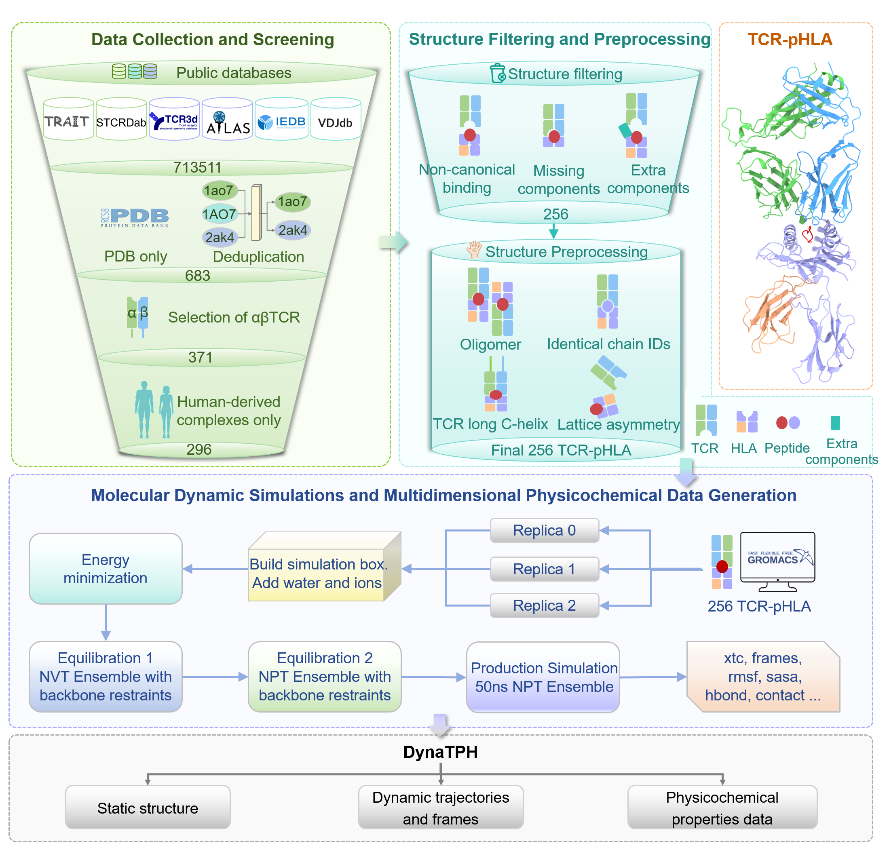
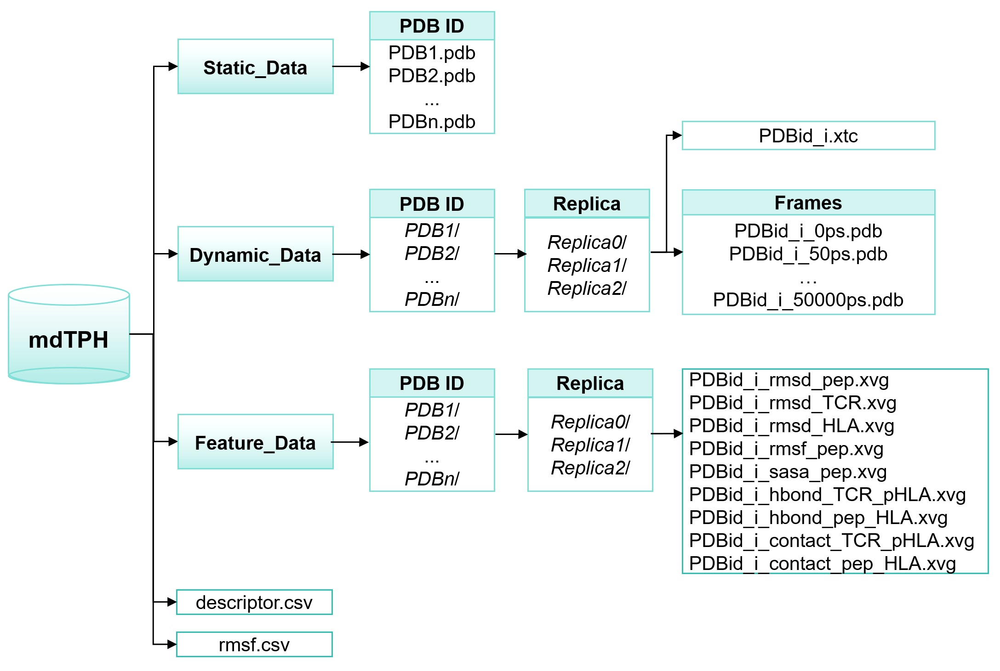

# DynaTPH Dataset Repository

Welcome to the DynaTPH dataset repository! 

DynaTPH is a systematically curated structural and biophysical dataset of human T cell receptor-peptide-human leukocyte antigen (TCR-pHLA) complexes, integrating **static experimental structures, molecular dynamics (MD) trajectories and corresponding structural frames, and multidimensional physicochemical properties**. The dataset covers both **HLA class I and class II** complexes and is designed to provide a comprehensive representation of the structural and dynamic landscape of TCR-pHLA recognition. DynaTPH comprises 256 representative TCR-pHLA complexes, each subjected to three independent 50 ns all-atom MD simulations, resulting in 38.4 μs of cumulative simulation time. The dataset includes curated starting structures, dynamic trajectories, trajectory-derived structural frames, and multidimensional physicochemical descriptors, including hydrogen bonds, intermolecular contacts, solvent-accessible surface area, and conformational flexibility. 

 **This GitHub repository contains a lightweight version of the DynaTPH dataset and dataset-specific scripts used for data collection and screening.**

---

## Useful Links

**Zenodo**：The complete DynaTPH dataset is available on Zenodo **DOI: 10.5281/zenodo.21971877** 
（The Zenodo repository is currently restricted for peer review.）

The complete `Dynamic Data` are archived on Zenodo because of their large storage requirements.

---

## Dataset Workflow
The overall workflow used to construct the DynaTPH dataset is illustrated below.

<p align="center">
  
</p>

The scripts provided in this repository correspond to the **Data Collection and Screening** stage of the workflow. Database-specific scripts were used to screen TCR-pHLA structures collected from multiple structural databases, followed by `combine.ipynb` for combining screened records and removing duplicate structures. Detailed information on script inputs, outputs, and usage is provided in scripts/README.md

---


## Dataset Overview

| Item                    | Description        |
| ----------------------- | ------------------ |
| Dataset                 | DynaTPH            |
| Molecular system        | TCR-pHLA complexes |
| Number of complexes     | 256                |
| HLA class I complexes   | 205                |
| HLA class II complexes  | 51                 |
| MD replicas per complex | 3                  |
| Total MD replicas       | 768                |
| Production simulation   | 50 ns per replica  |
| Total simulation time   | 38.4 μs            |
| Trajectory format       | XTC                |
| Structure format        | PDB                |
| Frame interval          | 50 ps              |
| Frames per replica      | 1,001              |

---

## Dataset Organization

The DynaTPH dataset is organized into three major data categories: **Static Data**, **Dynamic Data**, and **Feature Data**, together with system-level and residue-level descriptor files, `descriptor.csv` and `rmsf.csv`, respectively.

The overall organization of the dataset is illustrated below.

<p align="center">
  
</p>

Static Data — curated and standardized TCR-pHLA structural data;
Dynamic Data — molecular dynamics trajectories and frames generated for the 256 complexes;
Feature Data — structural and biophysical features derived from the structures and MD simulations;
descriptor.csv— structure-level descriptors for the TCR-pHLA complexes;
rmsf.csv— a residue-level table containing RMSF values derived from the MD trajectories.

**This GitHub repository contains the lightweight components of DynaTPH and is organized as follows:**

```text
DynaTPH/
├── Static Data/
├── Feature Data/
├── scripts/
├── descriptor.csv
├── rmsf.csv
└── README.md
```

---

## Data Description

### 1. Static Data

The `Static Data` directory contains curated TCR-pHLA complex structures used as the initial configurations for molecular dynamics simulations.

Each structure is provided in PDB format and named according to its PDB ID.

```text
Static Data/
├── 1BD2.pdb
├── XXXX.pdb
└── ...
```

A total of **256 TCR-pHLA complexes** are included.

The structures were curated and preprocessed before MD simulations to obtain standardized starting configurations. Structure preprocessing information is recorded in `descriptor.csv`.

---

### 2. Dynamic Data

The `Dynamic Data` directory contains the molecular dynamics trajectories and corresponding structural frames generated for the 256 TCR-pHLA complexes.

Because of the large size of the trajectory and frame files, **Dynamic Data is not included in this GitHub repository**.

Instead, the complete `Dynamic Data` directory is available as part of the full DynaTPH dataset archived on **Zenodo DOI: 10.5281/zenodo.21971877**.（The dataset is currently restricted for peer review and will be made publicly available soon.）

---

### 3. Feature Data

The `Feature Data` directory contains multidimensional physicochemical and structural descriptors derived from the molecular dynamics trajectories.

The directory is organized by PDB ID and simulation replica:

```text
Feature Data/
└── PDB_ID/
    ├── Replica0/
    ├── Replica1/
    └── Replica2/
```

The feature data include trajectory-derived properties such as:

* RMSD of the peptide, TCR, and HLA
* peptide RMSF
* solvent-accessible surface area (SASA)
* hydrogen-bond profiles
* contact profiles

Interface-specific descriptors are provided for both:

* `TCR_pHLA`: TCR-pHLA interface
* `pep_HLA`: peptide-HLA interface

These features provide complementary information on structural stability, conformational fluctuations, intermolecular hydrogen bonding, and interfacial contacts during the MD simulations.

---

### 4. `descriptor.csv`

`descriptor.csv` is the **system-level descriptor file** of DynaTPH.

Each row corresponds to one TCR-pHLA complex and is indexed by PDB ID.

The file contains structural, sequence, physicochemical, and dynamic information, including:

#### Structural and sequence information

* PDB ID
* HLA class
* HLA allele
* peptide sequence
* peptide length

#### Physicochemical and interface properties

* peptide SASA
* peptide-HLA hydrogen-bond counts
* peptide-HLA contact counts
* TCR-pHLA hydrogen-bond counts
* TCR-pHLA contact counts

Dynamic quantities were calculated from the three independent MD trajectories using a consistent analysis workflow and summarized at the system level.

Information describing structural modifications and preprocessing applied before MD simulations is also recorded in this file.

---

### 5. `rmsf.csv`

`rmsf.csv` provides **residue-level RMSF information for peptide residues** in individual TCR-pHLA complexes.

Each RMSF value is associated with a specific peptide residue and PDB ID.

Because peptide sequences have variable lengths, residue-level RMSF values are provided separately rather than being incorporated into the fixed-column, system-level `descriptor.csv`.

---


## Citation

If you use DynaTPH in your research, please cite the associated publication and the archived dataset.

Citation information for the associated publication will be provided here upon publication.

---

## Contact

For any questions regarding the dataset, please contact the corresponding author.

Lei Fu: [leifu@szu.edu.cn](mailto:leifu@szu.edu.cn)

Institute of Medical Artificial Intelligence, South China Hospital, Medical School, Shenzhen University, Shenzhen, 518116, P. R. China
